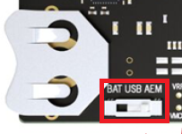

# Wi-SUN - SoC Empty

The Wi-SUN Empty sample application is a bare-bones application. This application can be used as a template to develop a Wi-SUN application.

## Getting Started

To get started with Wi-SUN and Simplicity Studio, see [QSG181: Wi-SUN SDK Quick Start Guide](https://www.silabs.com/documents/public/quick-start-guides/qsg181-wi-sun-sdk-quick-start-guide.pdf).

The SoC term stands for "System on Chip", meaning that this is a standalone application running on the EFR32 without any external MCU required.

As the name implies, the example is an empty template that only has the bare minimum to make a working Wi-SUN application. For this purpose, the example includes the Wi-SUN stack component and its dependencies (RTOS, cryptographic library...).This skeleton can be extended with application logic.

The development of a Wi-SUN application consists of two main steps:

* Responding to the events raised by the Wi-SUN stack
* Implementing additional application logic

## Responding to Wi-SUN Events

A Wi-SUN application is event-driven. The Wi-SUN stack generates events when a connection is successful, data has been sent, or an IP packet is received. The application has to handle these events in the *sl_wisun_on_event()* function. The prototype of this function is implemented in *app.c*. To handle more events, the switch-case statement of this function must be created and extended. For the list of Wi-SUN events, see [Wi-SUN API Reference](https://docs.silabs.com/wisun/latest/).

## Implementing Application Logic

Additional application logic can be implemented in the *app_task()* function. Find the definition of this function in *app.c*. The *app_task()* function is called once when the device is booted and after the Wi-SUN stack initialization.

The first step in most Wi-SUN applications is to call *sl_wisun_join()* to connect the Wi-SUN device to a Wi-SUN border router. The remaining implementation is up to the developer. Refer to the [Wi-SUN API Reference](https://docs.silabs.com/wisun/latest/) to check the list of Wi-SUN APIs available to the application.

## Troubleshooting

Before programming the radio board mounted on the WSTK, ensure the power supply switch is in the AEM position (right side), as shown.

## Resources

* [Wi-SUN Stack API documentation](https://docs.silabs.com/wisun/latest)
* [AN1330: Wi-SUN Mesh Network Performance](https://www.silabs.com/documents/public/application-notes/an1330-wi-sun-network-performance.pdf)
* [AN1332: Wi-SUN Network Setup and Configuration](https://www.silabs.com/documents/public/application-notes/an1332-wi-sun-network-configuration.pdf)
* [AN1364: Wi-SUN Network Performance Measurement Application](https://www.silabs.com/documents/public/application-notes/an1364-wi-sun-network-performance-measurement-app.pdf)
* [QSG181: Wi-SUN Quick-Start Guide](https://www.silabs.com/documents/public/quick-start-guides/qsg181-wi-sun-sdk-quick-start-guide.pdf)
* [UG495: Wi-SUN Developer's Guide](https://www.silabs.com/documents/public/user-guides/ug495-wi-sun-developers-guide.pdf)

## Report Bugs & Get Support

You are always encouraged and welcome to ask any questions or report any issues you found to us via [Silicon Labs Community](https://community.silabs.com/s/topic/0TO1M000000qHc6WAE/wisun).

## Cloning GitHub repository

### Step 1: Go to "https://github.com/vaibhavnaware01/FAN10_FSK_FG12".

### Step 2: Download as zip.

### Step 3: Extract the .zip file 

### Step 4: Open "Simplicity Studio" 

### Step 5: Go to Install-->Manage Install Packages-->SDK and check geckoSDK version = 4.2.2

If geckoSDK version is not 4.2.2 you can go to "add-->version-->selecte version 4.2.2-->click FINISH"

The installation will take some time 

### Step 6: After completing the installation we will import the "FAN1.0_FSK_FG12-main" in our Simplicity Studio.

